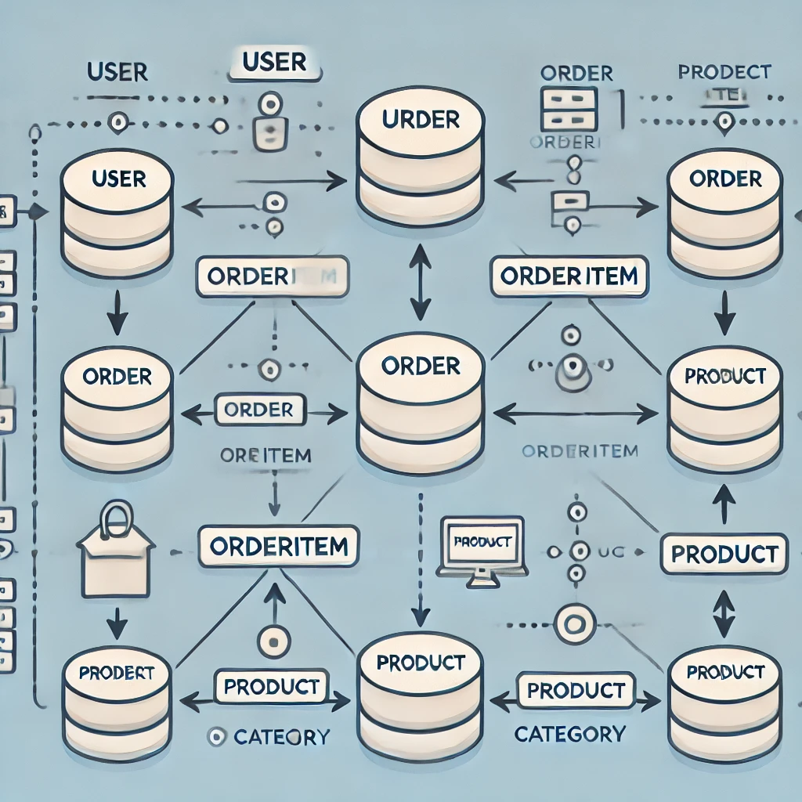

# Full-Stack-web-app
Here’s a draft README for **Shoppr**:

---

# Shoppr

**Shoppr** is a customizable e-commerce platform designed to showcase and sell pre-built e-commerce website templates. Clients can explore the available UIs, view prices, and make payments to hire a developer for customization services.

## Table of Contents

- [Project Overview](#project-overview)
- [Features](#features)
- [Tech Stack](#tech-stack)
- [File Structure](#file-structure)
- [Architecture](#architecture)
- [Setup and Installation](#setup-and-installation)
- [Usage](#usage)
- [API Endpoints](#api-endpoints)
- [Contact](#contact)

## Project Overview

Shoppr provides a convenient way for clients to select from pre-designed e-commerce templates, make payments, and receive customization services from a developer. This project involves a full-stack architecture built with TypeScript, Prisma, and React, and integrates payment and notification systems for a seamless user experience.

## Features

- **E-commerce Template Display**: Showcase multiple e-commerce templates with individual price tags.
- **Authentication**: Sign-in functionality with email notifications.
- **Payments**: Integrated Razorpay for secure payment processing.
- **Notifications**: Toast notifications using Sooner for in-app feedback.
- **Customizable UI**: Clients can choose templates and customize them according to their requirements.

## Tech Stack

### Frontend
- **Framework**: React (with Vite)
- **Styling**: Tailwind CSS
- **Notifications**: Sooner
- **Language**: TypeScript

### Backend
- **Framework**: Node.js with Express
- **Database**: PostgreSQL
- **ORM**: Prisma
- **Payments**: Razorpay
- **Email Notifications**: Nodemailer
- **Language**: TypeScript

## File Structure

### Frontend

The frontend code is organized as follows:

```plaintext
Frontend
│
├── public/                 # Public assets
├── src/
│   ├── assets/             # Static assets like images and icons
│   ├── components/         # Reusable components organized by feature
│   │   ├── cart/           # Cart-related components
│   │   ├── Modals/         # Modals used across the application
│   │   └── Skeletons/      # Skeleton loaders for better UX
│   ├── hooks/              # Custom hooks for managing state and logic
│   ├── pages/              # Pages that define main routes
│   ├── styles/             # Custom CSS styles
│   ├── App.tsx             # Main app component
│   ├── main.tsx            # Entry point for the app
│   └── vite-env.d.ts       # TypeScript environment definitions for Vite
├── .env                    # Environment variables
└── package.json            # Project dependencies
```

### Backend

The backend code is structured as follows:

```plaintext
Backend
│
├── prisma/
│   ├── migrations/         # Prisma migration files
│   └── schema.prisma       # Prisma schema definition
├── src/
│   ├── controllers/        # Request handlers for different API endpoints
│   ├── middlewares/        # Middleware functions for authentication and validation
│   ├── routes/             # API route definitions
│   ├── services/           # Business logic and service layer
│   └── index.ts            # Main entry point for the server
├── .env                    # Environment variables
└── package.json            # Project dependencies
```

## Architecture

### Frontend

The frontend is built using React with Vite for a faster development experience. The application is organized into reusable components, hooks, and pages to ensure modularity and scalability. Each major feature (like cart, modals, and skeleton loaders) is encapsulated within its own folder for easier maintenance.

- **Components**: Organized by functionality, including Cart, Modals, Skeletons, and other reusable elements.
- **Pages**: Includes main pages for the landing, product display, and authentication.
- **Toast Notifications**: Implemented using Sooner for real-time feedback to the user.

### Backend

The backend is structured with a service-oriented architecture, where each component is divided into layers for better organization and separation of concerns. Key elements include:

- **Controllers**: Manage HTTP requests, calling the necessary services and responding to the client.
- **Services**: Handle core business logic and interact with the Prisma ORM to access the PostgreSQL database.
- **Middlewares**: Ensure secure and validated requests, particularly for authentication and data validation.
- **Razorpay Integration**: Provides a secure way to handle payments, ensuring a smooth transaction process for users.
- **Email Notifications**: Utilizes Nodemailer to send emails on account creation, enhancing user engagement.

## Setup and Installation

1. **Clone the Repository**

   ```bash
   git clone https://github.com/Vansh1379/Shoppr.git
   ```

2. **Install Dependencies**

   - Navigate to both the frontend and backend directories and run:

     ```bash
     npm install
     ```

3. **Configure Environment Variables**

   - Set up the `.env` files in both the frontend and backend, including variables for database connection, email settings, and Razorpay keys.

4. **Run Migrations (Backend)**

   ```bash
   npx prisma migrate dev
   ```

5. **Start the Development Servers**

   - Frontend:

     ```bash
     npm run dev
     ```

   - Backend:

     ```bash
     npm run dev
     ```

## Usage

- **Authentication**: Users can sign up and receive a welcome email on successful account creation.
- **Browse Templates**: Users can view available templates with pricing information.
- **Payments**: Users can make payments through Razorpay to initiate customization.
- **Toast Notifications**: Notifications will appear in-app to guide users through actions and inform them of successes or errors.

## API Endpoints

| Endpoint               | Method | Description                            |
|------------------------|--------|----------------------------------------|
| `/api/auth/signup`     | POST   | Registers a new user                  |
| `/api/auth/signin`     | POST   | Authenticates a user                  |
| `/api/products`        | GET    | Retrieves a list of available products|
| `/api/products/:id`    | GET    | Retrieves details of a specific product|
| `/api/cart`            | POST   | Adds items to the cart                |
| `/api/cart`            | GET    | Gets items in the user’s cart         |
| `/api/checkout`        | POST   | Initiates Razorpay checkout for payment|

## Contact

For questions or feedback, feel free to reach out:

- **Email**: [Your Email Address]
- **GitHub**: [Your GitHub Profile]

---

Let me know if you’d like to add or modify any details!

key learning 

-one to one realtionship with cart of user a user can have only one cart 

- one to many realtionships in schema a user acan have more than one orders thart's why we have use order[] here and cart ther ... 
